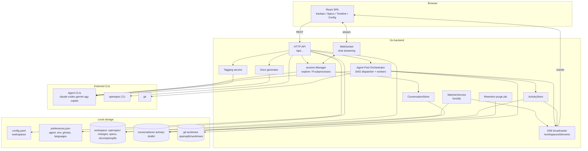

# opensp8c — Architecture

## High-level structure

opensp8c is a single deployable: a **Go backend** that exposes an HTTP API, SSE and WebSocket endpoints, watches the filesystem, and spawns agent subprocesses; and a **React (Vite) frontend** built to static files and embedded in the Go binary with `//go:embed`. Any non-`/api/` route returns the SPA's `index.html`.

## Backend components

### Workspace and file-based state
- **Workspaces** are listed in `config.yaml` (path only; removing one never touches the project). Each must contain `openspec/`.
- The source of truth for a change is the filesystem: `openspec/changes/<name>/` with `proposal.md`, `design.md`, `tasks.md`, `specs/`, and `.openspec.yaml`. The Kanban status is **derived** (e.g. no tasks → *To Explore*; tasks but not `launched` → *Ready*; `launched` → *To Do*; some checked → *In Progress*; all checked → *Done* or *To Review* under `hitl-review`).
- `.openspec.yaml` carries persistent metadata: `launched`, `order` (priority rank), dependencies (for the DAG), and `tags` (`type`, `complexity`, `components`, `agent_specialization`, `_auto`, `_tagged_at`).
- `preferences.json` (global, workspace-independent) stores the default agent, global and per-agent environment variables, per-session agent lock (`sessionAgents`), Claude session ids for named sessions, ghost (exploration) records, custom agent specializations, native question mode flag, agent languages and the app language. It also holds `agentSettings` (agent/model/effort per role), `poolDefaults` and a `workspaces` section keyed by workspace stable id with per-workspace overrides (`agentSettings`, partial `pool` (size, delegation mode, max attempts, `validationCommand`), `env`, `agentEnv`); every field is optional and an absent one means "inherit".

### Agent role settings (`preferences` + `agents`)
Every agent subprocess belongs to one **role**: `explorer` (named and anonymous explorations), `ff` (fast-forward and artifact generation from a promoted exploration), `implementer` (pool workers, including the self-healing loop, which shares the worker's subprocess), `fixer` (a worker restarted after "Demander des corrections"; resolved and applied by `Worker.Role`, but the HITL correction flow has no backend entry point yet) and `documenter` (docs generation).
- `Preferences.ResolveRole(workspaceID, role, lockedAgent)` is pure and nil-safe. The **agent** comes from the first defined level among workspace role → workspace global → Configuration role → Configuration global → default agent (an exploration's locked agent wins). **Model** and **effort** are resolved field by field over the same levels, but a level only counts when its effective agent equals the resolved agent; otherwise the Claude preset of the role applies (`explorer` opus/high, `ff`/`implementer`/`fixer` sonnet/medium, `documenter` haiku/low), then nothing (CLI default). An effort outside the agent's `EffortLevels` is dropped.
- The agent registry (`agents.AgentConfig`) declares `ModelFlag`, `EffortFlag`, `EffortLevels`, `SeedModels` and an optional `ListModels` (`agy models`, 3 s timeout, merged with the seed list, cached for a few minutes, seed fallback). `BuildSubprocessArgs` appends the model flag then the effort flag only when both flag and value are non-empty; `preferences.ApplyRole` fills `Model`/`Effort` just before launch, so `session.StartSubprocess` keeps its signature. Environment is layered global → agent → workspace → workspace agent (`EnvForWorkspace`).
- Pool configuration resolves workspace override → `poolDefaults` → built-in (3 / `hitl-review` / 3); `pool.Manager.Start` completes the fields omitted from the request without persisting anything.
- API: `GET`/`PATCH /api/preferences` carry `agentSettings` (stored values, plus `resolvedAgentSettings`) and `poolDefaults`; `GET`/`PATCH /api/workspaces/{id}/settings` return `{ overrides, inherited, resolved }` and merge a partial update (`null` resets a field to inheritance, 404 for an unknown workspace); `GET /api/agents/models` returns, per agent, `{ models[{id,label,source}], effortLevels, supportsModel, supportsEffort }`. All updates are validated (known agent and role, effort in the agent's levels, model without leading dash, whitespace or control characters, pool size 1–5) before anything is written.

### Real-time channel (SSE + fsnotify)
`WatcherService` starts on `openspec/` and lazily extends recursively (`changes/`, each change, `archive/`). File events are debounced (150 ms per change) and pushed on `/api/workspaces/{id}/events` as `change_updated`, `change_created`, `change_deleted`, plus `spec_updated`. Non-file events are emitted immediately: `pool_updated`, `activity_appended`, `ff_started/ff_done/ff_failed`, `ghost_card_created`, `ghost_named`, `draft_updated`, `exploration_deleted`. A `ping` every 30 s keeps the stream alive. The frontend reacts with react-query invalidation — there is **no polling fallback**.

### Agent sessions (`session.Manager`)
- Long-lived agent subprocesses for exploration, fully separate namespaces: named `workspaceID/changeName`, anonymous keyed by UUID, fast-forward `workspaceID/__ff__/changeName`.
- Chat traffic flows subprocess stdout → in-memory ring buffer (500 messages) → WebSocket, with full replay on reconnect (ended by a `replay_done` event; the browser merges it with its displayed history so replies show once). Idle sessions end after 30 minutes and can be resumed with `--resume <claudeSessionId>`, for named sessions and explorations alike; the browser localStorage transcript is re-injected only when the backend signals `session_restarted` (resume failed or unsupported agent).
- The backend parses **markers** embedded in the agent stream (`ghost_named`, `ghost_question`, `ghost_draft_updated`, `change_created`) and strips `ghost_question` from the text forwarded to the client by regex on each decoded message. `ghost_named` is stripped differently because streaming fragments it token by token (`{"`, `event"`, …): for anonymous sessions a stateful `MarkerFilter` (`session/marker_filter.go`) holds back text that may still become the marker, drops it once its JSON object closes, and releases the held text if it turns out not to be a marker or at block end. The consolidated message is cleaned by regex, and the frontend re-applies a stateless `stripGhostMarkers` on the accumulated text as a safety net. The name is still extracted from the raw message and sent as a `ghost_named` WS event carrying the final name (collision suffix included), which the frontend turns into a single compact `notice` line in the thread. For Claude with native question mode enabled it instead intercepts `AskUserQuestion` `tool_use` blocks and answers with a `tool_result`.
- **Agent adaptation**: each supported CLI is launched with its own flags; Gemini and Antigravity (`agy`) go through bridges that translate stdin/stdout between the app's stream-json protocol and the CLI's native one. Language instructions are injected via system prompt when available, otherwise prepended to the message. Environment is layered: OS env ← global `env` ← `agentEnv.<agent>`.
- stderr is logged with a prefix; critical errors (`TerminalQuotaError`, `ProjectIdRequiredError`) become `session_warning` events with a `fatal` flag.
- The agent of a session is locked at creation (falls back to Claude with a warning if no longer installed). `GET /api/agents` probes installed CLIs and always answers within ~5 s (3 s per probe).

### Agent Pool Orchestrator
One pool per workspace, independently started/stopped (double start → error). Config: `size` 1–5 and `delegation_mode`. The **dispatcher** builds a DAG from the dependencies in `.openspec.yaml` of *To Do* changes and dispatches runnable ones by ascending `order`. Each **worker**:
1. provisions branch `feature/<name>` and a git worktree under `.opensp8c/worktrees/wt-<name>` idempotently: branch existence is read from the exit code of `git show-ref`, and an existing branch and worktree are reused as-is (uncommitted work is never reset), so any resume finds its work again;
2. runs a real non-interactive agent session to implement `tasks.md`;
3. runs the validation command; on a failing test re-injects errors in the same session (self-healing) up to `max_attempts`. The command is resolved at each run: the workspace `validationCommand` (run with `sh -c` at the worktree root), else the Configuration default, else **auto-detection** over the worktree root and its direct subdirectories (hidden ones and `node_modules` excluded): `go test ./...` for a `go.mod`, `npm test` for a `package.json` with a `test` script *and* an installed `node_modules` (a `package.json` with a `test` script but no `node_modules` is a detected but unvalidable project: it is never skipped silently, it is an environment error even when other commands were detected, and no command runs); each command runs in its own directory and the first failure stops the run. An environment error (nothing to run, unvalidable Node project, executable not found, missing directory) pauses the worker **immediately** with a readable reason, without a heal turn or a used attempt;
4. verifies no unchecked task remains, then finalizes — auto-merge (`full-autonomy`) or move to *To Review* (`hitl-review`).
Failures (including a failed provisioning) put the worker in `paused` with a human-readable reason. A paused change is excluded from the dispatcher until the user **explicitly resumes** it (`POST /api/workspaces/{id}/pool/workers/{workerId}/resume`, the "Resume" button of the Kanban pool panel; 404 if the worker is not paused, 409 if the pool is stopped) or stops the pool; the next tick then redistributes the change into its existing branch and worktree. Status transitions emit `pool_updated` and activity entries.

### Tagging, staleness, docs, retention
- **Tagging**: `type` derived heuristically from path prefixes in `tasks.md` (`frontend/`, `backend/`, `scripts/`|`batch/`); `complexity`, `components` and `agent_specialization` via `claude --print` on proposal/design, the latter constrained to a closed vocabulary (base list + user extensions) and filtered afterwards. Runs at archive time, on manual `retag`, and as a chronological background batch at startup. Silent no-op if `claude` is missing.
- **Stale detection**: computed per `/changes` call from `tasks.md` mtime vs `stale_threshold_days` (default 7); only `in-progress` and `done` can be stale.
- **Docs generator**: one agent run per workspace, guarded against concurrency; specs are read by the agent from disk (not passed on the command line, to avoid argument-size limits); output confined to `docs/opensp8c/`; freshness compared to `spec.md` mtimes.
- **Retention job**: at startup and periodically purges conversation and activity logs `changeLogRetentionDays` after archive and unpromoted exploration logs `exploreLogRetentionDays` after last activity (defaults 15).

### Storage of conversations and activity
- `ConversationStore`: JSONL per run at `conversations/<ws>/<change>/<kind>/<ts>.jsonl` (`kind` = `ff`, `chat`, …) and `conversations/<ws>/_explore/<ghostSessionId>/…` before promotion; logs are copied/moved to the change on promotion. Session chat logs record `in`/`out`/`err` lines.
- `ActivityStore`: append-only `activity/<ws>/<change>/activity.jsonl` for non-agent events (task toggle, run trigger, tasks reset, worker status, detected git commit). Failures to write never fail the originating request. `GET …/activity` merges these with entries derived from conversation runs (narration, tool calls with durations).
- `drafts/<ghostId>.json` stores task drafts next to `preferences.json`.

## Frontend

React SPA with react-query, i18next and a shared Axios client that **normalizes errors** (server text or `{error}` body becomes `err.message`).

- **Layout**: top navigation for workspace-scoped tabs (Kanban, Specs, Timeline, Agents, Settings), collapsible left sidebar (Configuration entry, default-agent selector, project list with status badges), page/fullpage modes.
- **Kanban**: six slots, search filter, drag-and-drop with allowed-transition matrix and drop indicators, inline `DetailPanel` (420 px) and resizable bottom explore panel (200 px – 90% height, maximizable).
- **Explore panels**: full-width turns (no bubbles), collapsible tool-call rows, question cards with staged answers, raw/rendered markdown toggle (`localStorage`), scroll-lock, waiting indicator.
- **Specs / Timeline**: spec browser with sticky TOC and inline editor with live diff; Timeline with Changes/Matrix modes; Documentation sub-tab rendering Markdown and Mermaid (raw fallback on invalid diagrams).
- **Configuration**: sub-sections Agent Pool (pool defaults plus the visibility view), Columns (agent/model/effort per role), CLI (registry, env vars, native question mode, per-agent view) and Language (UI language plus chat/documentation/code agent languages).
- **Settings**: scoped to the active workspace, with sub-tabs Agent Pool, Columns, Environment and Specializations that override Configuration for that workspace only.
- **i18n**: 8 namespaces (`common`, `navigation`, `kanban`, `detailPanel`, `workspace`, `specs`, `explore`, `dialogs`), EN default, FR complete.

## Key technical decisions

1. **Filesystem as source of truth** — no database; statuses are derived, changes propagate via fsnotify → SSE.
2. **SSE for state, WebSocket for chat** — react-query invalidation keeps UI consistent without polling.
3. **Isolation by git worktree** — parallel agents never share a working directory; rollback keeps the worktree.
4. **Agent-agnostic core** — CLI differences are pushed into thin bridges, per-agent env and flags; session agent is locked.
5. **Marker protocol over agent text** — a small set of JSON markers works for every CLI, with optional native mode for Claude.
6. **Best-effort side effects** — activity logging, tagging, git-commit detection and language resolution never block the main flow (defaults are used on failure).
7. **Single binary** — frontend embedded; configurable `--port`/`--host` (flag > env > `8080`/`0.0.0.0`); multi-stage Docker image.
