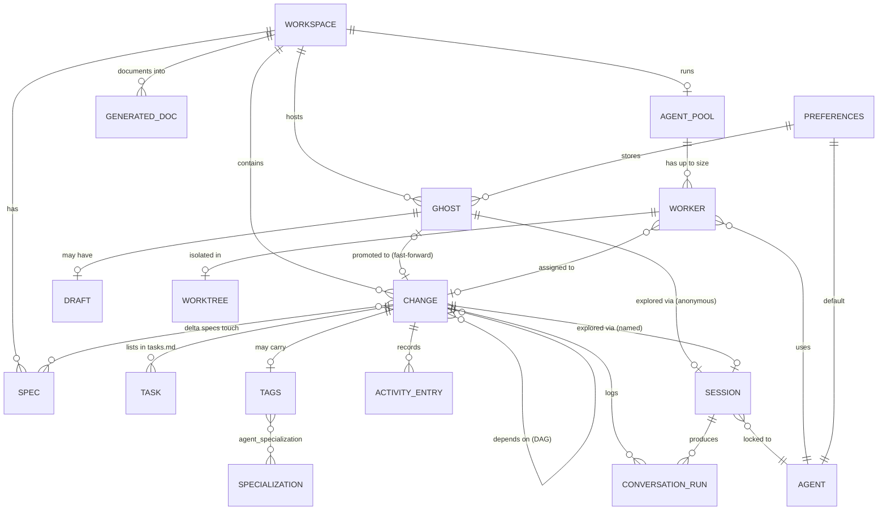
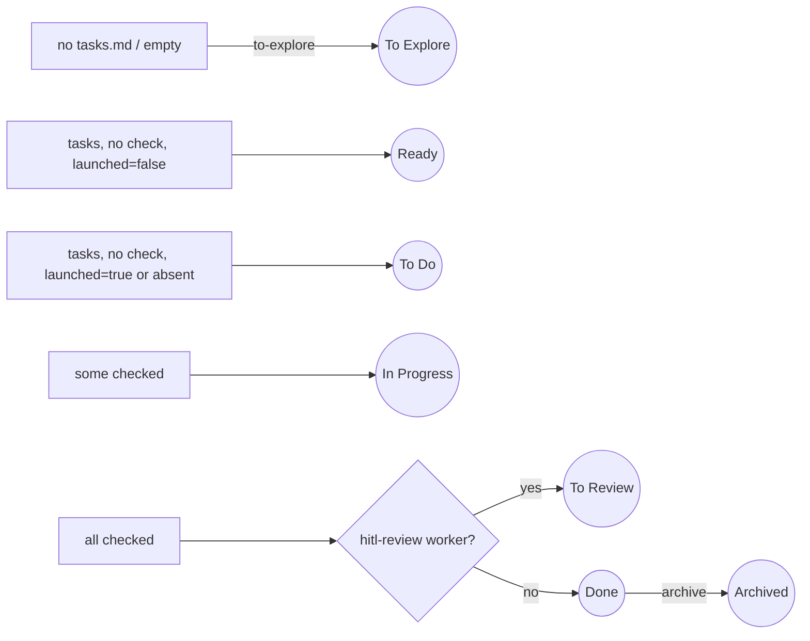

# opensp8c — Domain model

## Core concepts

- **Workspace** — a project directory containing `openspec/`, registered in `config.yaml`. It owns changes, specs, an optional agent pool, ghosts and generated docs.
- **Change** — an OpenSpec change (`openspec/changes/<name>/`) with `proposal.md`, `design.md`, `tasks.md`, delta `specs/` and `.openspec.yaml`. Its **Kanban status** is derived from its files and metadata: `to-explore`, `ready`, `todo`, `in-progress`, `to-review`, `done`, `archived`.
- **Task** — a checkbox line in `tasks.md` (`[ ]` / `[x]`), addressed by index.
- **Spec** — a consolidated capability spec (`openspec/specs/<name>/spec.md`) made of requirements and scenarios. Changes reference specs through their delta `specs/`; a reference to a missing spec is an **orphan**.
- **Tags** — semantic metadata on a change: `type[]` (frontend/backend/batch), `complexity` (1–5), `components[]` (open vocabulary), `agent_specialization[]` (closed vocabulary = base list + user extensions).
- **Launch marker and priority** — `launched` (Ready vs To Do) and `order` (priority rank) stored in `.openspec.yaml`; dependencies between changes form a DAG.
- **Ghost (exploration)** — a record for an exploration not yet turned into a change: `{id, workspaceId, name, sessionId, createdAt, lastActivityAt}`, shown as a dashed card in *To Explore*. It may have a **draft** (`name`, `description`, `tasks[]`, `lastSavedAt`). A ghost is *promoted* (fast-forward) into a real change; the change is a "draft" until the ghost is *solidified* (deleted).
- **Session** — a live agent subprocess: *named* (bound to a change), *anonymous* (bound to a ghost UUID) or *fast-forward* (isolated namespace). Locked to one **Agent** at creation.
- **Agent** — a supported CLI (Claude, Codex, Gemini, Antigravity, Copilot) with installed/version status and its own environment dictionary.
- **Conversation run / Activity entry** — persisted JSONL logs: agent messages per run (`ConversationStore`) and non-agent events (`ActivityStore`); merged into the change's *Conversation* feed.
- **Agent Pool, Worker, Worktree** — a per-workspace pool (`size` 1–5, `delegation_mode`) of workers, each assigned one change, working in its own git branch/worktree, with a status (`idle`, `working`, `testing`, `healing`, `paused`) and a block reason when paused.
- **Preferences** — global settings: default agent, env vars, native question mode, agent languages (`chat`, `documentation`, `code`), custom specializations, ghosts, session-agent map.
- **Generated documentation** — pages under `docs/opensp8c/` produced by an agent run, with a freshness flag.

## Relationships

## Kanban status derivation

## Invariants worth knowing

- A missing `launched` field means *launched* (backward compatibility); a reset to *To Explore* clears `launched` and `order` and empties `tasks.md` but keeps proposal, design and specs.
- Only `in-progress` and `done` changes can be *stale*; `todo`, `ready`, `to-explore`, `archived` never are.
- Base specialization tags are immutable; removing a custom tag never rewrites already-tagged changes.
- Agent language `code` cannot be `auto`; `chat` and `documentation` can (resolved from the app language, English if unknown).
- A ghost survives promotion (so exploration can continue) until the draft change is solidified or the change is deleted (cascade).
- Only one pool per workspace and one fast-forward or docs run per change/workspace at a time.
