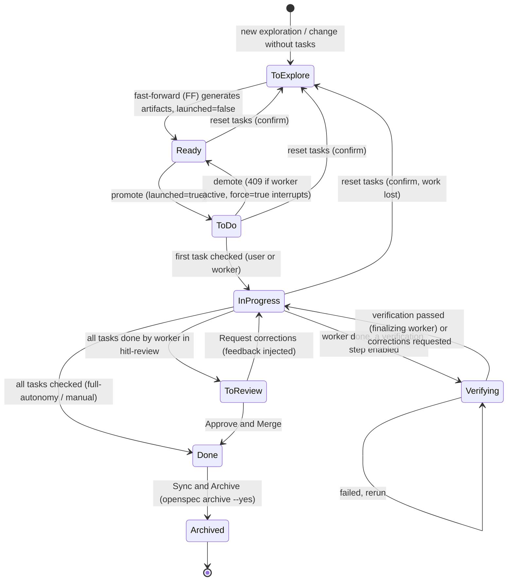
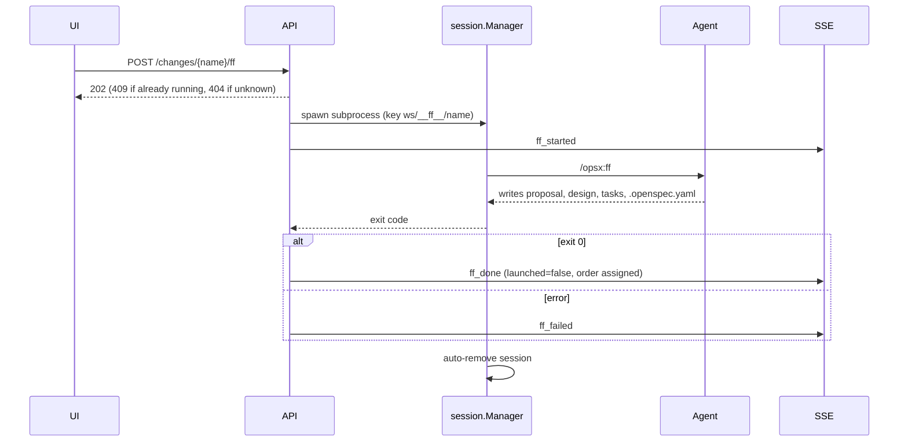
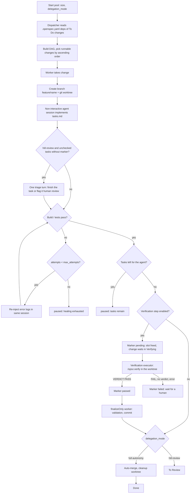

# opensp8c — Workflows

The product is organized around the lifecycle of an OpenSpec **change**. This page walks through it and the main supporting sequences.

## 1. Change lifecycle on the Kanban



Allowed drag-and-drop transitions are exactly: `to-explore → ready` (FF, or promote dialog for named ghosts), `ready → todo`, `todo → ready`, `ready|todo|in-progress → to-explore` (reset with confirmation), and reordering inside *Ready*. *Done*, *Archived* and *Verifying* cards cannot be dragged and *Verifying* is not a drop target; a card with a running FF is locked.

## 2. Exploration to change

1. The user clicks "+" (header or permanent "+ New exploration" card) → an anonymous session opens in the bottom panel; the agent greets briefly and frames the exploration.
2. On the **first user message** a ghost record is created (`explore-<6chars>`, `ghost_card_created`).
3. The agent emits `ghost_named` → the card is renamed (numeric suffix on collision) and becomes draggable.
4. Questions arrive as `ghost_question` markers → question cards; answers are staged locally, then sent as one consolidated message. Task drafts (`ghost_draft_updated`) fill the right-hand split panel and are auto-saved (500 ms debounce).
5. The user promotes the ghost (drag to *Ready* or the "Create the change" button) after a confirmation dialog.
6. `POST …/promote` runs `/opsx:ff` in the live session, or in a new subprocess with replayed context and the draft if the session expired. `ff_started` → spinner; on success logs are copied to the change, the change appears in *Ready* as a dashed "draft", and `ff_done` fires. On failure `ff_failed` and the ghost/draft stay for retry.
7. "Freeze" (or editing a task, or dragging to *In Progress*) **solidifies** the change by deleting the ghost and draft.

Session resume: 30 min of inactivity ends the subprocess; named sessions and explorations both restart with `--resume <claudeSessionId>` (an exploration keeps its own id, stored with its record). If the resume fails, or the agent has no resume support (Antigravity, Codex, Copilot), the backend sends `session_restarted` and only then does the browser re-inject its localStorage transcript (≤ 60 000 chars in full, otherwise first 5 exchanges + last 30 messages); reopening a panel whose context is kept sends nothing to the agent. A question left pending is re-asked automatically. If a Claude turn looks stuck (no agent message for 60 s while waiting, 180 s during a tool call), a **Restart agent** button restarts the subprocess with `--resume` without losing the history.

## 3. Fast-forward run (background)



## 4. Agent pool execution



**Verification stage.** When the verification settings (change, workspace, Configuration: first defined wins, off by default) enable at least one step, a worker that has implemented, validated and committed a change does not finalize it: it sets the marker `branch.feature/<change>.opensp8c-verify` to `pending` in the repository's git configuration (like the review marker: no tracked file, dropped with the branch, survives a restart), ends with the outcome `awaiting-verification` and frees its slot; worktree and branch stay. The change is then in the **Verifying** column, stacked under *In Progress* in the same slot (shown when a step is enabled for the workspace or when it holds a card; its cards cannot be dragged). The pool's `tick` starts a verification for each `pending` change, by name order, up to the pool size; this limit is separate from the worker slots, and it stops with the pool (the marker stays `pending`, so the verification restarts from scratch with the pool). The steps run in order and stop at the first failure. The conformity step starts an agent with the `verifier` role in the change's worktree, with a system prompt forbidding any file change and requiring a last line `VERDICT: PASS` or `VERDICT: FAIL`, and sends one `/opsx:verify <change>` turn. The last `VERDICT:` line of the answer decides; a missing verdict, an agent error or idleness, or any change to the worktree is a failure (fail-closed). The run is journalled as a `verify` conversation run (end marker with step, verdict, reason and report) and logged in the change's activity (`pool.verification_started` / `passed` / `failed`).

**UI step.** When `ui` is enabled (and a conformity step that is also enabled passed), the step runs after the conformity: a run is journalled per step (`verify_run_start` / `verify_run_end` carry the `step`; `GET …/verification/report` returns the most recent run, or `?step=` the latest of a step). The step fails at once, without starting anything, when `uiStartCommand` or `uiBaseUrl` is not configured. Otherwise it first takes the **UI lock**, a single FIFO lock for the whole backend (ports, database and browser belong to the machine, not to a workspace): a verification queued on it is in the `waiting` state (`verification_state`, card badge « en attente de l'interface »), does not use a pool slot and so never delays the conformity of other changes; a stop of the pool or a cancellation while waiting drops it from the queue and leaves its marker `pending`. The platform then picks a free port, substitutes `{port}` in `uiStartCommand` and `uiBaseUrl`, starts the command with `sh -c` in the change's worktree (own process group; environment `PORT`, `OPENSP8C_UI_PORT`, `OPENSP8C_UI_URL`, `OPENSP8C_WORKSPACE_PATH` = the main repository) and waits until the base URL answers with a status below 500 (start timeout 2 min; a command that exits first fails the step with its exit code and the last output lines). Once the application is up, an agent with the `verifier` role gets one turn: the base URL, the evidence directory (`OPENSP8C_VERIFY_ARTIFACTS`, `conversations/<ws>/<change>/verify/<run>/`), the `#### Scenario:` blocks of the change's delta specs and the unchecked tasks carrying `<!-- human review required -->`. The agent chooses its own browsing tool, must not touch the repository, saves screenshots in the evidence directory and ends with `VERDICT: PASS`, `FAIL` or `SKIP` (nothing observable in the interface), plus one `TASK-VERIFIED: <task text>` line per marked task it verified. `PASS` and `SKIP` succeed, anything else fails (missing verdict, agent error or idleness, step timeout of 45 min, a *tracked* file modified: untracked files created by the application are fine), and a `SKIP` that leaves unchecked marked tasks fails with « tâches de validation humaine non vérifiées ». After a `PASS` only, the platform ticks each declared task in the branch's `tasks.md`, one `Validate task N` commit per task, marker kept; the agent never writes `tasks.md`. A `TASK-VERIFIED` line matching no unchecked marked task is ignored and listed in the report. The application's process group is always stopped when the step ends (SIGTERM, then SIGKILL after a grace period), whatever the outcome, and the lock released. The detail panel shows the screenshots as thumbnails with a closable viewer, the ticked tasks and the ignored lines.

Example settings (Configuration or workspace; `{port}` is the free port picked at launch, also exported as `PORT`). The worktree has no `node_modules` or build: the command must install what it needs.

| Project | `uiStartCommand` | `uiBaseUrl` |
|---|---|---|
| Node (Vite) | `npm ci && npm run dev -- --port {port} --strictPort` | `http://localhost:{port}` |
| Go (reads `PORT`) | `go run .` | `http://127.0.0.1:{port}` |

On success the marker becomes `passed`: the next tick that finds a free worker slot starts a `finalizeOnly` worker for the change (no agent; it lifts the marker first, then validates, commits and merges or moves to To Review), without going through the verification again. On failure the marker becomes `failed`: the card stays in *Verifying* with a failure badge, nothing is retried or repaired automatically, and the detail panel shows the report with three actions: **Rerun** (`pending` again), **Finalize without verification** (`passed`; refused with `409 tasks_incomplete` while a task of the branch is unchecked) and **Request corrections** (a correction task is committed in the branch, the marker lifted, the change goes back to a worker). While a verification runs, task ticks and a reset to To Explore are refused (`verification_busy`).

**Human validation tasks.** A `tasks.md` line carrying the HTML comment `<!-- human review required -->` is a task only the user can validate (manual walkthrough, visual check, command to run). In `full-autonomy` every unchecked task blocks the worker, marker or not. In `hitl-review` the completion check ignores unchecked marked tasks, so a change left with only those goes to **To Review** instead of pausing; an unchecked task without marker still pauses the worker. Before validation, `hitl-review` workers get one *triage* turn when unmarked tasks remain: for each, finish and check it, or add the marker without checking it. Each task flagged by the triage is logged as a `pool.task_flagged` activity entry. The agent's system prompt also forbids it to check a marked task. The same rule applies when a worker resumes after a correction request; "Resume and finalize" still requires every task to be checked.

Worker startup or invocation failures also end in `paused` with a readable reason. Stopping the pool stops all workers; a single worker can be interrupted by demoting its card with `force=true` (worktree and commits are kept). Every worker status change emits `pool_updated` and an activity entry.

## 5. Human review (HITL)

1. A finished change lands in **To Review**; clicking the card opens the review panel (changed files, interactive diff, feedback box).
2. **Approve and Merge** → the feature branch is merged into the current branch, the worktree removed, the card moved to *Done*.
3. **Request corrections** → feedback is sent, the card returns to *In Progress*, and the worker restarts with the feedback injected into its system prompt.

**Tasks to validate.** In review, tasks carrying the marker show a *Human validation* badge in the Tasks tab, with a "N tasks to validate" count above the list. **Approve and Merge** stays visible but disabled (tooltip "N tasks to validate") while any task of the branch is unchecked, marked or not; ticking the last one enables it without reload. Dropping a To Review card with unchecked tasks on *Done* is refused with a notification. The backend enforces the same rule: `POST …/review/approve` answers `409` `tasks_pending` (with `remaining`) before any integration, validation or merge; an already merged branch (cleanup retry) skips the check.

**Tasks follow the branch.** As soon as a change owns a `feature/<change>` branch and no worker holds it, the detail panel and the card counters read the tasks from the branch (its worktree if present, else the committed `tasks.md`), not from the main repository. Ticking a task then edits that file and creates **one commit per tick** in the branch (`chore(scope): Validate task N` / `Reopen task N`, body `Change:` and `Task:`), so the tick is merged by Approve and the main repository stays clean. The column is not recomputed from the branch: it still derives from the review marker, the launched state and the main repository. A tick is refused with `409` (`review_busy`) while an approval, correction or reset runs on the change, and (`worker_active`) while a worker holds it; with a worker holding the change the tick edits its worktree without commit, as before.

**Reset to To Explore** (drag to the *To Explore* column) on a change owning a branch deletes the branch, its worktree and the review marker, then empties `tasks.md`; the confirmation dialog warns about the loss even when no task is ticked. It is refused with `409` while a worker is active (`worker_active`) or a review action runs (`review_busy`); a paused worker is released first. If the cleanup fails nothing else is modified.

### Commit messages

Every commit the application creates for a change follows Conventional Commits: `type(scope): Subject`, a blank line, then a body whose first line is `Change: <change-name>`.

- **Type**: from the first word of the change name (`fix`, `refactor`, `perf`, `doc`/`docs` → `docs`, `test`, `chore`, `ci`, `build`, `style`), `feat` otherwise. The review-correction commit is always `chore`.
- **Scope**: first non-empty `tags.components` of the change's `.openspec.yaml`, else the first (alphabetical) folder of the change's `specs/`, else omitted (`type: Subject`). Normalized to lowercase, with other characters replaced by `-`.
- **Subject**: the change name with `-`/`_` turned into spaces and a capital first letter, cut on a word boundary so the header stays within 72 characters (the full name stays in the body).
- **Worker commit and `--no-ff` merge** share the same header and body; the correction commit is `chore(scope): Add review correction`. The integration merge of the target branch into the change branch keeps git's own message.

Example, change `improve-matrix-change-drilldown-nav` with component `timeline-spec-matrix`:

```
feat(timeline-spec-matrix): Improve matrix change drilldown nav

Change: improve-matrix-change-drilldown-nav
```

## 6. Archive

*Done* card → "Sync & Archive" → confirmation dialog → `openspec archive <name> --yes` (specs are synced automatically) → spinner, then toast and card moves to *Archived*; on error the CLI output is shown with a "Retry" button. Archiving triggers tagging if tags are missing, and starts the log-retention clock (`changeLogRetentionDays`).

## 7. Documentation generation

1. In Specs → Documentation the user clicks **Generate** (disabled while a run is active for the workspace).
2. One agent run reads all `openspec/specs/*/spec.md` from disk and writes `overview.md`, `architecture.md`, `domain-model.md` and — only when a multi-step lifecycle exists — `workflows.md`, in the resolved `documentation` language, under `docs/opensp8c/`.
3. On completion the page list refreshes; a "potentially outdated" badge appears whenever any `spec.md` is newer than every generated page.

## 8. Language resolution at agent launch

UI language change → sent to backend and persisted → at each agent launch `chat`, `documentation` and `code` are resolved (`auto` → app language, else English) → the instruction is injected (system prompt or message prefix) according to the agent's role: exploration gets `chat`; docs generation, FF and promotion get `documentation`; pool workers get `code` plus `documentation`. Running agents are never altered.
