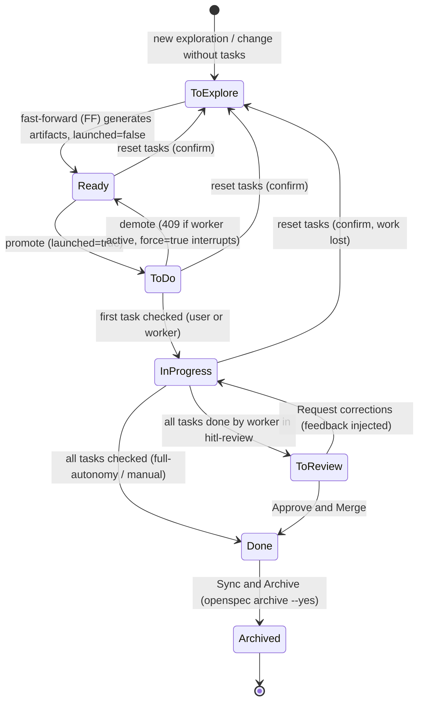
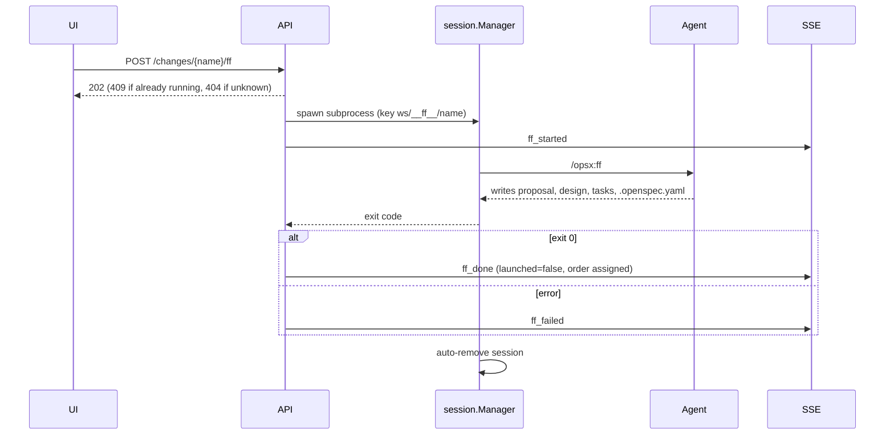
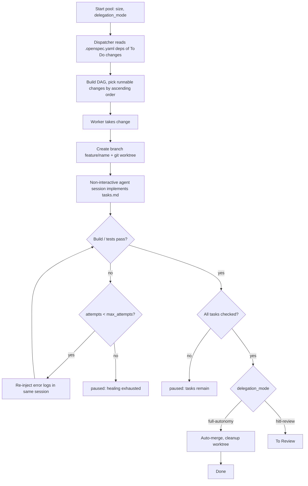

# opensp8c — Workflows

The product is organized around the lifecycle of an OpenSpec **change**. This page walks through it and the main supporting sequences.

## 1. Change lifecycle on the Kanban

Allowed drag-and-drop transitions are exactly: `to-explore → ready` (FF, or promote dialog for named ghosts), `ready → todo`, `todo → ready`, `ready|todo|in-progress → to-explore` (reset with confirmation), and reordering inside *Ready*. *Done* and *Archived* cards cannot be dragged; a card with a running FF is locked.

## 2. Exploration to change

1. The user clicks "+" (header or permanent "+ New exploration" card) → an anonymous session opens in the bottom panel; the agent greets briefly and frames the exploration.
2. On the **first user message** a ghost record is created (`explore-<6chars>`, `ghost_card_created`).
3. The agent emits `ghost_named` → the card is renamed (numeric suffix on collision) and becomes draggable.
4. Questions arrive as `ghost_question` markers → question cards; answers are staged locally, then sent as one consolidated message. Task drafts (`ghost_draft_updated`) fill the right-hand split panel and are auto-saved (500 ms debounce).
5. The user promotes the ghost (drag to *Ready* or the "Create the change" button) after a confirmation dialog.
6. `POST …/promote` runs `/opsx:ff` in the live session, or in a new subprocess with replayed context and the draft if the session expired. `ff_started` → spinner; on success logs are copied to the change, the change appears in *Ready* as a dashed "draft", and `ff_done` fires. On failure `ff_failed` and the ghost/draft stay for retry.
7. "Freeze" (or editing a task, or dragging to *In Progress*) **solidifies** the change by deleting the ghost and draft.

Session resume: 30 min of inactivity ends the subprocess; named sessions restart with `--resume`, anonymous ones with the same ghost id plus localStorage context (≤ 60 000 chars in full, otherwise first 5 exchanges + last 30 messages). A question left pending is re-asked automatically.

## 3. Fast-forward run (background)

## 4. Agent pool execution

Worker startup or invocation failures also end in `paused` with a readable reason. Stopping the pool stops all workers; a single worker can be interrupted by demoting its card with `force=true` (worktree and commits are kept). Every worker status change emits `pool_updated` and an activity entry.

## 5. Human review (HITL)

1. A finished change lands in **To Review**; clicking the card opens the review panel (changed files, interactive diff, feedback box).
2. **Approve and Merge** → the feature branch is merged into the current branch, the worktree removed, the card moved to *Done*.
3. **Request corrections** → feedback is sent, the card returns to *In Progress*, and the worker restarts with the feedback injected into its system prompt.

## 6. Archive

*Done* card → "Sync & Archive" → confirmation dialog → `openspec archive <name> --yes` (specs are synced automatically) → spinner, then toast and card moves to *Archived*; on error the CLI output is shown with a "Retry" button. Archiving triggers tagging if tags are missing, and starts the log-retention clock (`changeLogRetentionDays`).

## 7. Documentation generation

1. In Specs → Documentation the user clicks **Generate** (disabled while a run is active for the workspace).
2. One agent run reads all `openspec/specs/*/spec.md` from disk and writes `overview.md`, `architecture.md`, `domain-model.md` and — only when a multi-step lifecycle exists — `workflows.md`, in the resolved `documentation` language, under `docs/opensp8c/`.
3. On completion the page list refreshes; a "potentially outdated" badge appears whenever any `spec.md` is newer than every generated page.

## 8. Language resolution at agent launch

UI language change → sent to backend and persisted → at each agent launch `chat`, `documentation` and `code` are resolved (`auto` → app language, else English) → the instruction is injected (system prompt or message prefix) according to the agent's role: exploration gets `chat`; docs generation, FF and promotion get `documentation`; pool workers get `code` plus `documentation`. Running agents are never altered.
